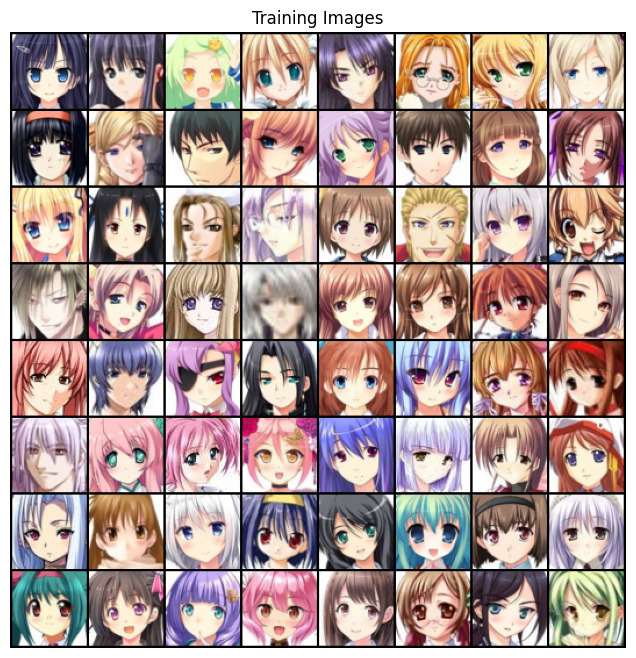
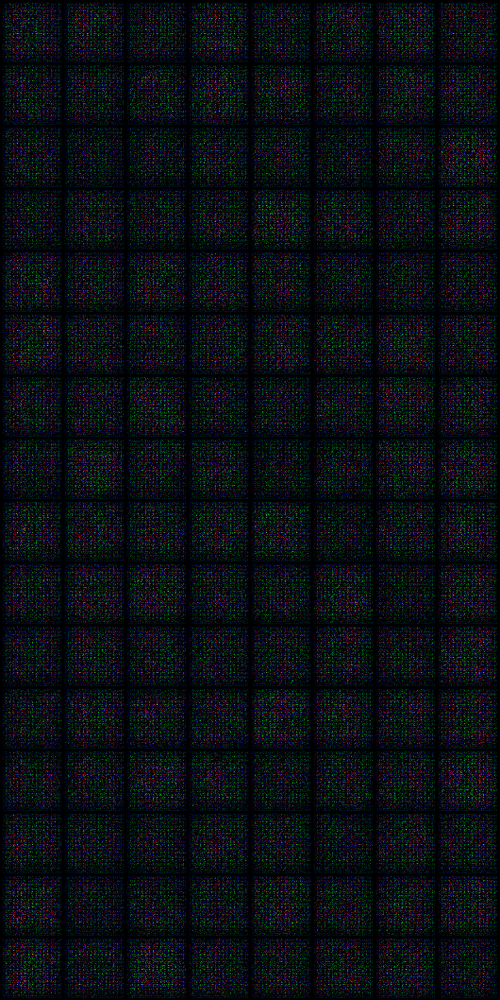
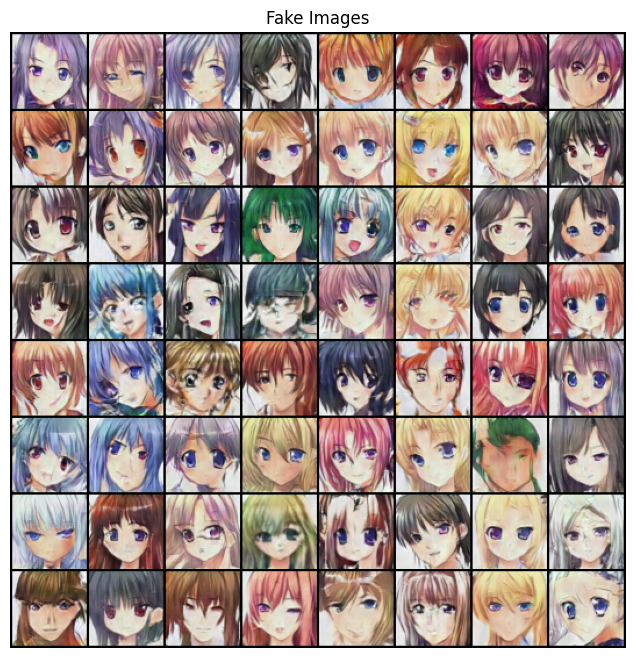
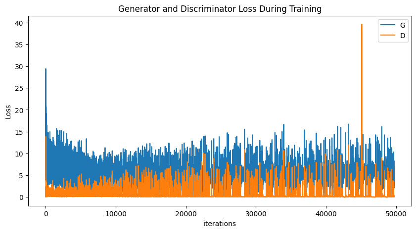
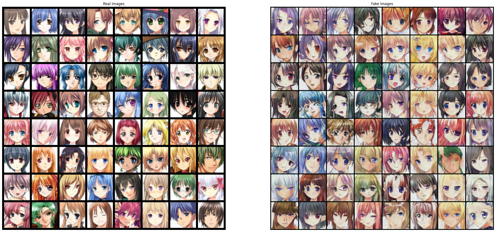

<h1 align="center">
  <b>Generative Adversarial Networks (DeepConvGAN)</b><br>
</h1>

<p align="center">
    <a href="https://www.python.org/">
    </a>
    <a href= "https://pytorch.org/">
    </a>
    <a href= "https://github.com/baohuy11/Variational-autoencoder/blob/main/LICENSE">
    </a>
</p>

A simple tutorial of Generative Adversarial Networks (DeepConvGAN) models. This repository contains the implementations of following GAN families.


* [DEEP_CONVOLUTIONAL_GENERATIVE_ADVERSARIAL_NETWORKS](https://arxiv.org/pdf/1511.06434) (Goodfellow, I., Pouget-Abadie, J., Mirza, M., Xu, B., Warde-Farley, D., Ozair, S., Courville, A., & Bengio, Y. (2014). Generative Adversarial Networks (arXiv:1406.2661))


# Requirements
```bash
pip install -r requirements.txt
```

# How-to-use
simply run the <file_name>.ipynb files using jupyter notebook.

# Experimental Results
## Deep Convolutional Generative Adversarial Network (DCGAN)
- Trained on animefacedataset for 100 epochs

- Training data

 

- Random noise data



- Generated images



- Generator and Discriminator Loss



- Training and generated data


